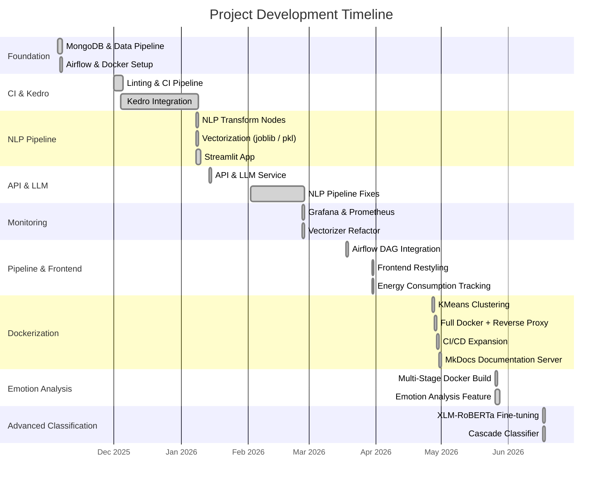

# Project Development Timeline

```mermaid
gantt
    title Project Development Timeline
    dateFormat  YYYY-MM-DD
    axisFormat  %b %Y

    section Foundation
    MongoDB & Data Pipeline        :done, 2025-11-05, 2025-11-07
    Airflow & Docker Setup         :done, 2025-11-06, 2025-11-07

    section CI & Kedro
    Linting & CI Pipeline          :done, 2025-12-01, 2025-12-05
    Kedro Integration              :done, 2025-12-04, 2026-01-09

    section NLP Pipeline
    NLP Transform Nodes            :done, 2026-01-08, 2026-01-09
    Vectorization (joblib / pkl)   :done, 2026-01-08, 2026-01-09
    Streamlit App                  :done, 2026-01-08, 2026-01-10

    section API & LLM
    API & LLM Service              :done, 2026-01-14, 2026-01-15
    NLP Pipeline Fixes             :done, 2026-02-02, 2026-02-27

    section Monitoring
    Grafana & Prometheus           :done, 2026-02-26, 2026-02-27
    Vectorizer Refactor            :done, 2026-02-26, 2026-02-27

    section Pipeline & Frontend
    Airflow DAG Integration        :done, 2026-03-18, 2026-03-19
    Frontend Restyling             :done, 2026-03-30, 2026-03-31
    Energy Consumption Tracking    :done, 2026-03-30, 2026-03-31

    section Dockerization
    KMeans Clustering              :done, 2026-04-27, 2026-04-28
    Full Docker + Reverse Proxy    :done, 2026-04-28, 2026-04-29
    CI/CD Expansion                :done, 2026-04-29, 2026-04-30
    MkDocs Documentation Server   :done, 2026-04-30, 2026-05-01

    section Emotion Analysis
    Multi-Stage Docker Build       :done, 2026-05-26, 2026-05-27
    Emotion Analysis Feature       :done, 2026-05-26, 2026-05-28

    section Advanced Classification
    XLM-RoBERTa Fine-tuning        :done, 2026-06-17, 2026-06-18
    Cascade Classifier             :done, 2026-06-17, 2026-06-18
```
